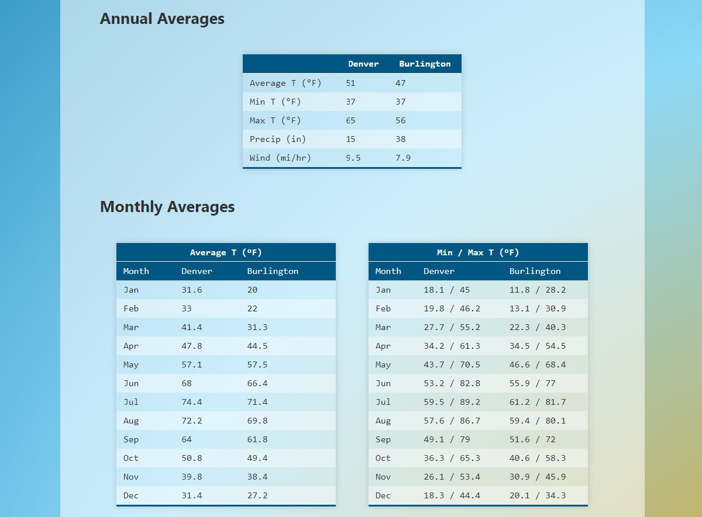

# Climate Comparison App

This application enables the user to quickly compare climates between two locations. View live [here](https://climate-comparison-app.netlify.app/)

## Motivation

Over the past 8 years, I've moved four times, each move to a different geographic region. When researching each potential location, I would obsessively check over these locations for criteria that I thought important, one of which was the general climate of each area. Thus, the idea was born to create a quick and easy tool to allow me to compare climates of varying locations. These tools do exist on the web, but I wanted to create a version with a simple, aesthetically pleasing UI, without all the accompanying adds and horizontal scrolling required for mobile devices.

## How to use

The UI is straightforward to use. Here are some pictures illustrating the different features available.

Summary tab shown after entering the two locations.

Summary tab in dark mode. Access by clicking button in upper-right.

Tables tab showing both annual and monthly averages.

Graphs tab charting the climate data.

## What I learned

This project was a great learning opportunity. I figured out how to implement both light and dark themes using Context. I learned how to consume data from a commercial API and save it in state to distribute to various components throughout the app. During this process, I learned important lessons about the asynchronous nature of fetch requests and the useState hook in React, as well as more use cases for the useEffect and useRef hooks. I was able to practice using the useContext hook and implement the newest version of React Router (v6). I also learned how to use an external charting library to visually display data, something I'm particularly interested in persuing in future projects.

## Technologies

This project was bootstrapped with [Create React App](https://github.com/facebook/create-react-app). The [MapQuest Geocode API](https://developer.mapquest.com/documentation/geocoding-api/) was used to retrieve latitude and longitude coordinates from locations names and the [MeteoStat API](https://dev.meteostat.net/api/point/normals.html) was used to retrieve climate data for said location, specifically Climate Normals data according to Point Data. The [Recharts](https://recharts.org/en-US/) library was used to create the featured graphs. [React Router](https://reactrouter.com/)(v6) was used to tab between content.

## Credits

[Create React App](https://github.com/facebook/create-react-app), 
[MapQuest Geocode API](https://developer.mapquest.com/documentation/geocoding-api/),
[MeteoStat API](https://dev.meteostat.net/api/point/normals.html),
[Recharts](https://recharts.org/en-US/)
[React Router](https://reactrouter.com/)(v6)

## Improvements

The mapquest geocode api works well for single word location names (e.g., Carrboro, NC), but sometimes has trouble receiving multiple word location names (e.g., San Diego, CA). In the future, I plan to implement the [Google Places API](https://developers.google.com/maps/documentation/places/web-service/overview) to achieve better results and also enable an autofill functionality to the search UI.
